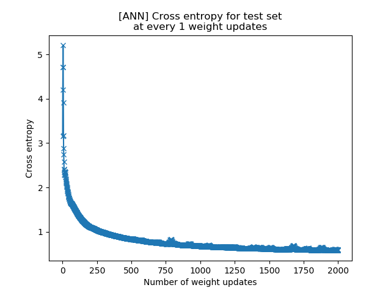

# SVHN-ML
This project is part of my personal journey thought Machine Learning and Deep Learning. I explore the SVHN dataset with different models and techniques I learn along the way.

## SVHN Dataset
"SVHN is a real-world image dataset for developing machine learning and object recognition algorithms with minimal requirement on data preprocessing and formatting. It can be seen as similar in flavor to MNIST (e.g., the images are of small cropped digits), but incorporates an order of magnitude more labeled data (over 600,000 digit images) and comes from a significantly harder, unsolved, real world problem (recognizing digits and numbers in natural scene images). SVHN is obtained from house numbers in Google Street View images." - [Street View House Numbers (SVHN) Dataset Home Page](http://ufldl.stanford.edu/housenumbers)

The dataset characteristics are:
- 10 classes, 1 for each digit.
- 73257 digits for training
- 26032 digits for testing
- 531131 additional samples

It comes in two formats:
- Original images with character level bounding boxes.


- MNIST-like 32-by-32 images centered around a single character (many of the images do contain some distractors at the sides).


In this project, I'm using the second format.

## Utilities
### Pre-processing
_preproc.py_ provides a loading data function and some utilities. If run as main, it transforms the dataset into a more convinient format for my machine learning models.

### Logging
_mylogger.py_ contains a auxiliary class for based on python's default _logging_ to encapsulate the logging system I'm using.

## Models
### Artificial Neural Network
_ann.py_ contains a ANN model with two hidden layers, Dropout Regularization and Adam as optimizer. After 3h30 of training, it achieved 84% test accuracy.



```
Loading data... Done. [Elapsed 0:00:02.394881]
Model fitting...
E: 001/500 B: 001/4 C: 3.161226 A: 12.32% [Elapsed 0:00:09.928410 of ~ 1:06:11.364000]
E: 001/500 B: 002/4 C: 4.200505 A: 18.22% [Elapsed 0:00:16.920150 of ~ 1:34:00.050000]
E: 001/500 B: 003/4 C: 4.719887 A: 19.98% [Elapsed 0:00:23.954733 of ~ 1:54:04.209429]
E: 001/500 B: 004/4 C: 5.206483 A: 19.97% [Elapsed 0:00:27.952459 of ~ 1:56:28.114750]
E: 002/500 B: 001/4 C: 4.714513 A: 20.99% [Elapsed 0:00:34.963955 of ~ 2:09:29.767778]
E: 002/500 B: 002/4 C: 3.914908 A: 22.62% [Elapsed 0:00:41.912708 of ~ 2:19:42.541600]
E: 002/500 B: 003/4 C: 3.173958 A: 24.00% [Elapsed 0:00:48.903403 of ~ 2:28:11.527818]
E: 002/500 B: 004/4 C: 2.877373 A: 22.92% [Elapsed 0:00:52.918071 of ~ 2:26:59.678500]
E: 003/500 B: 001/4 C: 2.738524 A: 22.17% [Elapsed 0:00:59.901502 of ~ 2:33:35.615692]
E: 003/500 B: 002/4 C: 2.574530 A: 23.13% [Elapsed 0:01:06.854454 of ~ 2:39:10.636286]
E: 003/500 B: 003/4 C: 2.420585 A: 24.78% [Elapsed 0:01:13.865665 of ~ 2:44:08.755333]
E: 003/500 B: 004/4 C: 2.402053 A: 24.98% [Elapsed 0:01:17.867769 of ~ 2:42:13.471125]
E: 004/500 B: 001/4 C: 2.351855 A: 26.23% [Elapsed 0:01:24.893387 of ~ 2:46:27.457294]
E: 004/500 B: 002/4 C: 2.289211 A: 27.40% [Elapsed 0:01:31.892706 of ~ 2:50:10.300667]
E: 004/500 B: 003/4 C: 2.276467 A: 27.27% [Elapsed 0:01:38.860597 of ~ 2:53:26.378632]
E: 004/500 B: 004/4 C: 2.330837 A: 27.07% [Elapsed 0:01:42.874476 of ~ 2:51:27.447600]
(...)
E: 497/500 B: 001/4 C: 0.602824 A: 83.27% [Elapsed 3:26:50.239442 of ~ 3:27:58.873245]
E: 497/500 B: 002/4 C: 0.585020 A: 83.95% [Elapsed 3:26:57.219922 of ~ 3:27:59.618012]
E: 497/500 B: 003/4 C: 0.578427 A: 84.14% [Elapsed 3:27:04.205178 of ~ 3:28:00.366829]
E: 497/500 B: 004/4 C: 0.593166 A: 83.71% [Elapsed 3:27:08.209907 of ~ 3:27:58.122397]
E: 498/500 B: 001/4 C: 0.595228 A: 83.66% [Elapsed 3:27:15.189022 of ~ 3:27:58.865050]
E: 498/500 B: 002/4 C: 0.581115 A: 84.05% [Elapsed 3:27:22.149991 of ~ 3:27:59.588757]
E: 498/500 B: 003/4 C: 0.579787 A: 84.05% [Elapsed 3:27:29.128905 of ~ 3:28:00.329729]
E: 498/500 B: 004/4 C: 0.595646 A: 83.50% [Elapsed 3:27:33.133238 of ~ 3:27:58.089417]
E: 499/500 B: 001/4 C: 0.599380 A: 83.36% [Elapsed 3:27:40.174209 of ~ 3:27:58.892548]
E: 499/500 B: 002/4 C: 0.584923 A: 83.91% [Elapsed 3:27:47.157816 of ~ 3:27:59.637453]
E: 499/500 B: 003/4 C: 0.577786 A: 84.15% [Elapsed 3:27:54.124733 of ~ 3:28:00.364915]
E: 499/500 B: 004/4 C: 0.588370 A: 83.91% [Elapsed 3:27:58.151942 of ~ 3:27:58.151942]
E: 500/500 B: 001/4 C: 0.591096 A: 83.85% [Elapsed 3:28:05.125151 of ~ 3:27:58.885708]
E: 500/500 B: 002/4 C: 0.581030 A: 84.05% [Elapsed 3:28:12.147726 of ~ 3:27:59.668058]
E: 500/500 B: 003/4 C: 0.578970 A: 84.04% [Elapsed 3:28:19.090338 of ~ 3:28:00.369783]
E: 500/500 B: 004/4 C: 0.589667 A: 83.62% [Elapsed 3:28:23.085737 of ~ 3:27:58.129478]
Model saved in path: ANN_results/ANN_model_2018-12-11_03-33-00.ckpt
Done. [Elapsed 3:28:23.948255]
```
